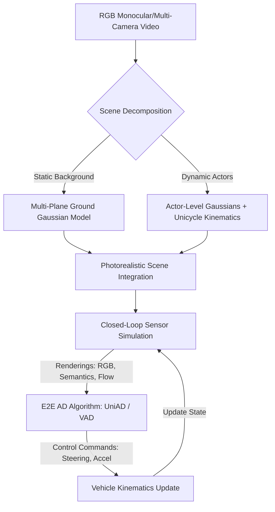

# 论文阅读伴侣：HUGSIM: A Real-Time, Photo-Realistic and Closed-Loop Simulator for Autonomous Driving

> **论文基本信息**
> - **标题**: HUGSIM: A Real-Time, Photo-Realistic and Closed-Loop Simulator for Autonomous Driving
> - **arXiv 编号**: [2412.01718](https://arxiv.org/abs/2412.01718)
> - **发表时间**: 2024年12月
> - **合作机构**: 浙江大学 (Zhejiang University)、华为 (Huawei)、图宾根大学 (University of Tübingen) 等
> - **项目主页**: [https://xdimlab.github.io/HUGSIM](https://xdimlab.github.io/HUGSIM)
> - **开源代码**: [https://github.com/xdimlab/HUGSIM](https://github.com/xdimlab/HUGSIM)
> - **本地 PDF 文件**:
>   - [英文原版 PDF](../papers/2412.01718_HUGSIM_A_Real-Time_Photo-Realistic_and_Closed-Loop_Simulator_for_Autonomous_Driving.pdf)
>   - [中文翻译版 PDF](../papers/2412.01718_HUGSIM_A_Real-Time_Photo-Realistic_and_Closed-Loop_Simulator_for_Autonomous_Driving_zh.pdf)

---

## 1. 核心研究背景与动机 (Motivation)

在自动驾驶（AD）的测试与验证中，业界一直面临着**保真度**与**闭环评测**的 trade-off（权衡）：

- **传统模拟器** (如 CARLA, Gazebo)：虽然完全支持**闭环仿真**（即自动驾驶系统的输出可以实时控制车辆并改变环境观测），但它们的图形质量是虚拟合成的，与真实世界存在巨大的**领域鸿沟 (Domain Gap)**，难以用于直接评测端到端的多相机视觉感知与规划模型。
- **基于神经渲染的仿真器** (如基于 NeRF 或 3DGS 的方法)：能够从录制的真实数据中重建出照片级逼真 (Photo-realistic) 的场景。但大多数现有的系统局限于**开环 (Open-loop)** 重建，一旦 Ego 车辆偏离原始轨迹（例如进行换道或避让操作），渲染外插视角（Novel View Extrapolation）时就会产生严重的拉伸、模糊或伪影。
- **对 LiDAR 的高度依赖**：以往许多先进的 3DGS 仿真器（如 StreetGaussians、NeuRAD 等）必须依赖高精度激光雷达（LiDAR）点云作为输入，而 HUGSIM 旨在实现一个**纯 RGB 图像输入**的重建与闭环仿真系统。

> [!IMPORTANT]
> **HUGSIM 的定位**：首个实现**纯 RGB 输入**、**实时（Real-time）**、**照片级逼真（Photo-realistic）**且支持**闭环（Closed-loop）**测试的自动驾驶仿真器。

---

## 2. 核心技术架构 (Methodology)

HUGSIM 的核心思想是将动态城市场景解耦为**静态背景**与**动态 Actor**，并利用 3DGS 进行高效重建与实时渲染。

### 2.1 多平面地面高斯模型 (Multi-Plane Ground Gaussian Model)

在 Ego 车辆偏离原始轨迹进行闭环转向或换道时，地面（路面）的视角拉伸变化是最为剧烈的，普通的 3DGS 容易在此处产生严重的漂移和拉伸块。

- **局限性**：由于自动驾驶场景是线性的长距离场景，单全局平面无法拟合带有坡度或起伏的路面。
- **HUGSIM 解决方案**：引入多平面地面高斯模型（Multi-plane Ground Model）。系统基于场景的局部几何结构，在不同距离段拟合局部的路面微平面。
- **路面正则化损失 $\mathcal{L}_{ground}$**：
  在训练中通过地面语义分割掩码，限制属于“道路”的高斯球的 z 轴向局部拟合的平面靠拢。这显著地平滑了路面反射，消除了超视距或换道视角下的路面拉伸和几何形变。

### 2.2 基于单轮车物理模型 (Unicycle Model) 的动态 Actor 重建

自动驾驶中，其他动态车辆（Actors）的 3D 边界框通常是通过感知模型（如 3D 目标检测与跟踪器）预测的，这包含大量的检测噪声和帧间抖动。如果直接将高斯球绑定到抖动的 bounding box 上，重建出来的车辆会出现画面撕裂和突变。

- **物理动力学约束**：HUGSIM 采用**单轮车模型 (Unicycle Model)** 来描述车辆运动：
  $$\dot{x} = v \cos(\theta), \quad \dot{y} = v \sin(\theta), \quad \dot{\theta} = \omega$$
- **全局轨迹优化**：把车辆从多帧离散的观测姿态优化成符合物理运动规律的平滑连续轨迹。
- **高斯球绑定**：将车辆高斯资产绑定在优化后的物理运动轨迹上，使得渲染时的车辆移动如真车般流畅，完全消除帧间突变和抖动伪影。

### 2.3 车辆资产移植与丰富 (Vehicle Asset Transplanting)

当进行闭环仿真或插入非原生 Actor（如在原始场景中不存在的测试车辆）时，需要高质量的车辆模型。
HUGSIM 支持直接从独立的车辆重建数据集（如 **3DRealCar**）中移植高质量的 3D 车辆 Gaussian 资产。这些资产支持 360 度任意视角的照片级逼真渲染，并且可以通过仿真器控制其在道路上做出超车、插队、急刹等对抗性或常规性动作。

---

## 3. HUGS 与 HUGSIM 的演进脉络对比

HUGSIM 是该课题组前作 **HUGS (Holistic Urban 3D Scene Understanding via Gaussian Splatting)** 的直接延伸。理解它们的区别对于把握该课题组的研究路线至关重要：

| 维度 | HUGS (CVPR 2024) | HUGSIM (arXiv 2024.12) |
| :--- | :--- | :--- |
| **主要定位** | **三维重建与场景理解**。侧重于解耦静态场景与动态物体，输出高保真的几何、外观与语义分割。 | **闭环仿真平台**。侧重于构建可交互、可控制、高渲染外插质量的自动驾驶仿真器。 |
| **测试模式** | **开环 (Open-loop)**。只能沿训练轨迹进行新视角合成，不具备动力学控制的反馈闭环。 | **闭环 (Closed-loop)**。Ego 及 Actor 都具备物理动力学模型，支持受动作驱动的状态更新。 |
| **路面建模** | 简单的全局/局部粗糙几何约束。在起伏路面和偏离车道时存在纹理模糊。 | **多平面地面高斯模型**。精细拟合非水平/起伏路面，显著改善换道外插视角渲染。 |
| **动态轨迹** | 依靠基础的 Bounding Box 和简单的平滑滤波。 | **Unicycle 物理运动学约束**。通过轨迹优化消除检测噪声，使轨迹完全符合真实车辆动力学。 |
| **资产库** | 仅使用原始视频中观测到的车辆，容易产生遮挡部分的缺失。 | 整合外部重构的车辆资产（如 3DRealCar），支持 360° 无死角非原生 Actor 渲染。 |

---

## 4. 闭环仿真与端到端算法评测结果

HUGSIM 重建了包含 nuScenes、Waymo、KITTI-360 和 PandaSet 等主流数据集中的 **70+ 个序列**，构建了 **400+ 个闭环测试场景**。它对当前先进的端到端（E2E）算法进行了闭环基准测试，得出了许多开环测试（Open-loop evaluation）中无法发现的重要学术结论：

### 4.1 主要评测模型
1. **UniAD** (Planning-oriented Autonomous Driving, CVPR 2023 Best Paper)
2. **VAD** (Vectorized Scene Representation)
3. **Latent-Transfuser**

### 4.2 核心学术发现
- **开环与闭环的表现差距**：有些算法在开环测试中碰撞率极低，轨迹误差很小；但在 HUGSIM 的闭环测试中，由于累计误差（Drift/Cascading Errors），车辆很容易偏离车道，或者由于对前车动向的估计误差导致碰撞。
- **UniAD 的轨迹后处理抖动**：闭环测试揭示出 UniAD 的后处理规划模块会导致车身在转向时产生非物理的微小高频抖动，这在传统的开环重放（Replay-based）评测中是无法被定量检测到的。
- **闭环仿真的不可替代性**：这证明了使用高保真神经渲染来进行端到端 AD 算法的闭环评测，能够揭示出决策层与控制层更深层次的耦合缺陷。

---

## 5. 建议论文阅读路径

为了让您能够更深入地吸收这篇论文，建议按以下步骤进行阅读：

1. **第一步：对比理解（对照中文 PDF）**
   - 重点阅读 **Section 3. Methodology**，观察图 2 中的整体 Pipeline，特别注意静态与动态高斯是如何在每一个 timestep 被渲染并融合在一起的。
2. **第二步：公式探究**
   - 寻找关于 `Multi-plane Ground Model` 的公式，弄清局部地平面约束损失 $\mathcal{L}_{ground}$ 是如何计算并作用于高斯球的平滑性的。
   - 重点分析 `Unicycle Model` 轨迹优化公式，了解目标函数中观测 bounding box 的拟合误差与运动学物理约束项（比如速度、角速度的平滑项）之间的平衡。
3. **第三步：闭环评测的指标**
   - 阅读 **Section 4. Experiments**，查看表格中闭环指标（如 Collision Rate 碰撞率、Off-road Rate 偏离道路率、L2 Distance 轨迹误差）的定义，分析为什么开环指标表现好而闭环指标差。

---

> [!TIP]
> 如果您在阅读过程中对其中的 **公式推导**、**代码实现（例如 Ground Gaussian 的约束 loss 实现）** 或者 **如何与 UniAD 闭环对接** 存在疑问，随时可以让我为您进行深度拆解！
